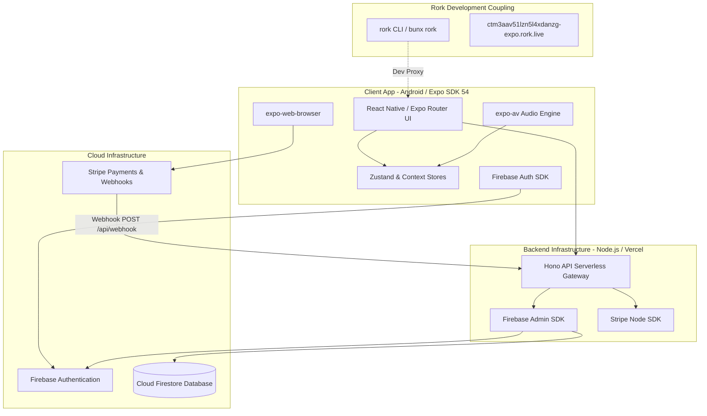
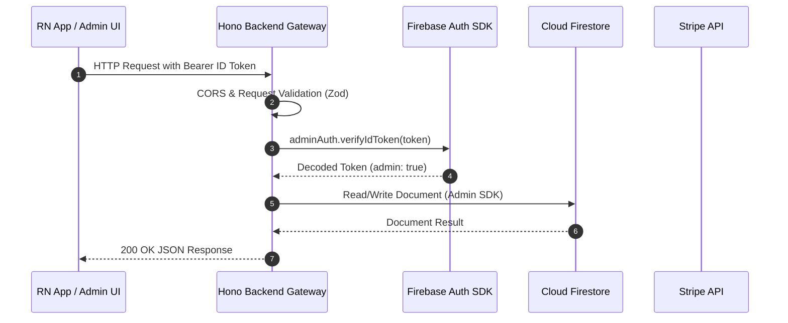
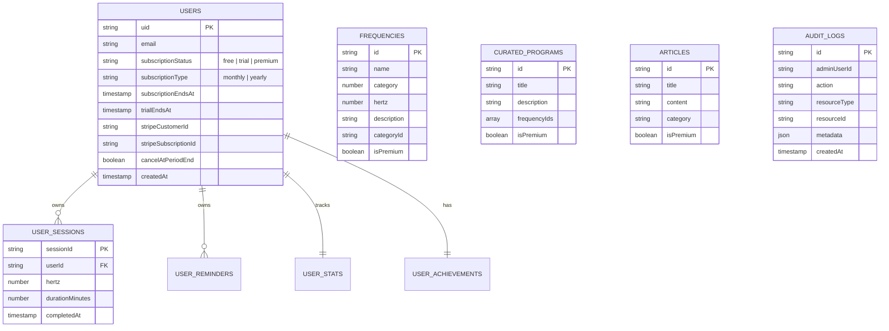
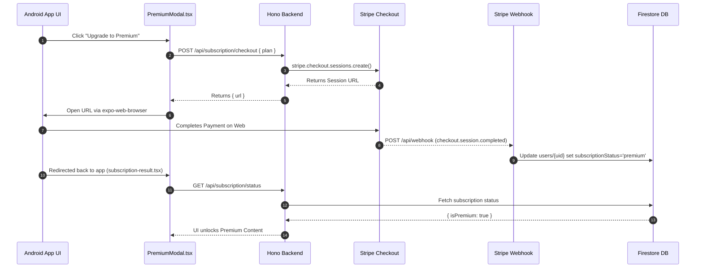
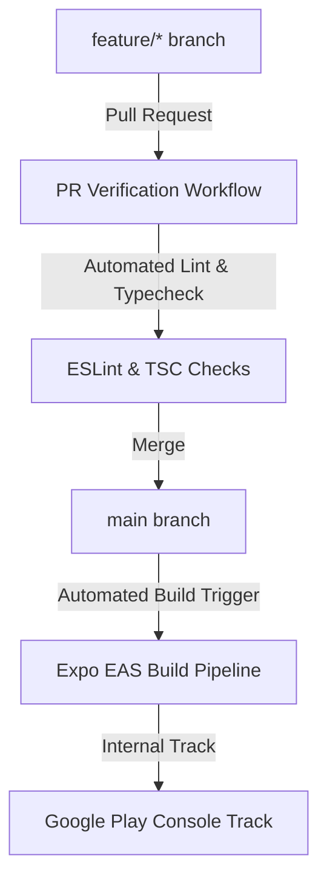
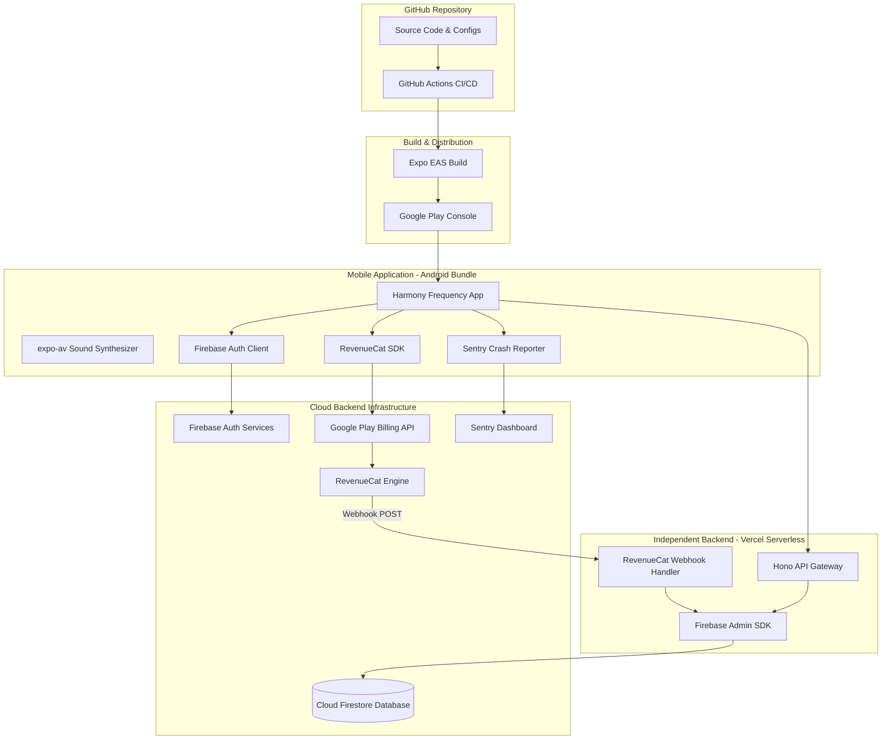

# HARMONY FREQUENCY
# CODEBASE & PRODUCTION READINESS AUDIT

**Date:** March 2025
**Auditor:** Senior Mobile Architect & Technical Auditor (Jules)
**Target Platform:** Android (Google Play Store)
**Primary Goal:** Forensic audit of Rork-generated codebase to establish full infrastructure independence, security compliance, Google Play readiness, and production release roadmap.

---

## 1. Executive Summary

### A. Current State
The Harmony Frequency application is a React Native / Expo (SDK 54) mobile application designed for Android, supported by a serverless Hono (Node.js) backend API, Firebase Authentication, Cloud Firestore, and Stripe subscription management. The codebase was originally generated using Rork AI and subsequently exported into a GitHub repository (`/expo` directory).

From an architectural standpoint, the project exhibits strong foundational design:
* It employs a **Hono API gateway** (`expo/backend/hono.ts`) running on Node.js/Vercel serverless functions.
* It utilizes **Firebase Authentication with Custom Claims** for administrative access control.
* It leverages **Cloud Firestore Security Rules** to restrict user data and prevent client-side tampering of subscription states.
* It includes an **in-app administrator portal** (`expo/app/admin`) with full management capabilities over audio frequencies, user roles, articles, and curated programs.

### B. Core Verdict & Production Readiness Score
**Overall Production Readiness Score: 6.2 / 10**

While the application code is functional, structured, and feature-complete for an MVP, **it cannot be released to the Google Play Store in its current state**. It contains key architectural blockers, platform policy violations, and infrastructure coupling to Rork.

### C. Critical Release Blockers (P0 Summary)
1. **Google Play Digital Subscriptions Violation (Policy 3.8):** The current application uses Stripe Checkout webview redirects (`expo-web-browser`) for selling digital subscriptions. Google Play Policy strictly requires Google Play Billing (IAP) for in-app digital items on Android. Utilizing Stripe webviews for digital content will result in immediate Play Store rejection or account suspension.
2. **Rork Build & CLI Coupling:** The build scripts (`package.json`), Metro configuration (`metro.config.js`), and SDK dependencies (`@rork-ai/toolkit-sdk`) rely on Rork CLI utilities (`bunx rork start`).
3. **Rork Default Application Identifiers:** The Android package identifier in `app.json` is set to `app.rork.harmonyfrequency-your-spiritual-soundscape`, and deep linking origins point to `https://rork.com/`.
4. **Exposed Setup Endpoint:** The backend exposes a `/admin/setup` endpoint protected only by a shared secret (`ADMIN_SECRET_KEY`) that grants super-admin privileges over any user account.
5. **Missing Test & CI/CD Infrastructure:** Zero automated unit, integration, or end-to-end tests exist, and no EAS (`eas.json`) or GitHub Actions configurations are present.

---

## 2. Current Architecture

### A. System Architecture Diagram



### B. Backend Resolution & Request Routing Logic
The application resolves its backend API endpoint dynamically in `expo/lib/subscription-service.ts` and `expo/backend/hono.ts` via the following cascade:

1. **Priority 1 (Production Custom Backend):**
   Reads `process.env.EXPO_PUBLIC_API_BASE_URL`. If present, all API requests (`/api/subscription/*`, `/frequencies`, `/data`, `/admin/*`) are directed to this custom serverless API deployment (e.g., Vercel).
2. **Priority 2 (Rork API Base URL):**
   Fallback to `process.env.EXPO_PUBLIC_RORK_API_BASE_URL` when operating inside Rork's hosted environment.
3. **Priority 3 (Rork Live Fallback):**
   Hardcoded URL fallback in `expo/backend/hono.ts` lines 919 & 976 to `https://ctm3aav51lzn5l4xdanzg-expo.rork.live`.
4. **Priority 4 (Local Development Fallback):**
   In web browser mode, falls back to `window.location.origin`.

---

## 3. Repository Inventory

The repository is structured as a mono-repo-like root containing the primary project in `./expo`:

```text
/ (Repository Root)
├── README.md                          # Basic title document
└── expo/                              # Main application package
    ├── app/                           # Expo Router (v6) file-based screens
    │   ├── _layout.tsx                # Root app layout & font loader
    │   ├── index.tsx                  # Main entry point & redirect
    │   ├── setup.tsx                  # Admin bootstrap UI screen
    │   ├── subscription-result.tsx    # Stripe redirect outcome handler
    │   ├── +native-intent.tsx         # Intent handler for deep links
    │   ├── +not-found.tsx             # 404 fallback screen
    │   ├── (tabs)/                    # Main user bottom-tab navigation
    │   │   ├── _layout.tsx            # Tab bar setup & styling
    │   │   ├── sessions.tsx           # Session player & generator tab
    │   │   ├── categories.tsx         # Frequency library & categories tab
    │   │   ├── learn.tsx              # Articles & educational content tab
    │   │   └── settings.tsx           # User settings & profile tab
    │   └── admin/                     # Admin portal routes
    │       ├── _layout.tsx            # Admin auth guard & layout
    │       ├── login.tsx              # Admin login screen
    │       └── (dashboard)/           # Protected admin dashboard tabs
    │           ├── _layout.tsx        # Dashboard layout & sidebar
    │           ├── index.tsx          # Analytics & overview
    │           ├── frequencies.tsx    # Frequency catalogue CRUD
    │           ├── learning.tsx       # Educational articles CRUD
    │           ├── sessions.tsx       # Curated programs CRUD
    │           ├── users.tsx          # User management & admin claim assignment
    │           └── settings.tsx       # System status & data reset
    ├── backend/                       # Server backend implementation
    │   ├── hono.ts                    # Hono REST API server (1,210 lines)
    │   ├── seed.ts                    # Firestore database seed script
    │   └── trpc/                      # Stubbed tRPC routers (unused/legacy)
    ├── components/                    # React Native UI components
    │   ├── AudioPlayer.tsx            # Core audio playback & frequency controls
    │   ├── AuthScreen.tsx             # User authentication modal/screen
    │   ├── AuthWrapper.tsx            # Auth context provider wrapper
    │   ├── CreateSessionModal.tsx     # Custom frequency session creator
    │   ├── DataModeIndicator.tsx      # Debug UI for network/mock mode
    │   ├── ErrorBoundary.tsx          # React error boundary catcher
    │   ├── FrequencyInfoModal.tsx     # Detailed frequency science modal
    │   ├── FrequencyVisualizer.tsx    # Animated canvas visualizer
    │   ├── GlassCard.tsx              # Translucent glassmorphism UI container
    │   ├── PremiumGate.tsx            # Paywall access controller
    │   ├── PremiumModal.tsx           # Subscription purchase modal
    │   ├── PremiumStatusBar.tsx       # Premium subscription badge
    │   └── SessionTimer.tsx           # Timer component for audio sessions
    ├── hooks/                         # Custom React hooks & state
    │   ├── useAdminAuth.ts            # Admin authentication & custom claim check
    │   ├── useAdminData.ts            # Admin dashboard API data fetcher
    │   ├── useAudioPlayer.ts          # expo-av sound generation controller
    │   ├── useAuth.ts                 # User authentication context hook
    │   ├── useBackendData.ts          # Dual-mode (remote/local) content fetcher
    │   ├── useDataHelpers.ts          # Content filter & lookup helpers
    │   ├── useDataInitialization.ts   # Startup initialiser for local state
    │   ├── useDataModes.ts            # State toggle for online/offline mock mode
    │   ├── useFavorites.ts            # Local storage for user favorite frequencies
    │   ├── useLearningContent.ts      # Educational articles state
    │   ├── usePremiumUsage.ts         # Free usage tracking & limit enforcement
    │   ├── useSessionManager.ts       # Saved custom user audio sessions
    │   ├── useSettings.ts             # App settings storage hook
    │   └── useTheme.ts                # Color palette & theme provider
    ├── lib/                           # Core utilities & SDK integrations
    │   ├── firebase.ts                # Client-side Firebase App init
    │   ├── firebase-auth.ts           # Firebase Auth client wrapper & error mapping
    │   ├── firebase-admin.ts          # Server-side Firebase Admin SDK init
    │   ├── stripe-server.ts           # Server-side Stripe API wrapper
    │   ├── subscription-service.ts    # Client-side subscription API client
    │   └── validation.ts              # Zod schemas for backend request payloads
    ├── constants/                     # Static constants & default datasets
    │   ├── frequencies.ts             # Default Solfeggio & Brainwave frequency catalog
    │   └── theme.ts                   # UI colors, typography, and styling tokens
    ├── assets/                        # Fonts and images
    ├── app.json                       # Expo configuration file
    ├── babel.config.js                # Babel build configuration
    ├── eslint.config.js               # ESLint 9 configuration
    ├── firebase.json                  # Firebase CLI configuration
    ├── firestore.rules                # Production Firestore security rules
    ├── metro.config.js                # Metro bundler configuration
    ├── package.json                   # NPM dependencies & scripts
    ├── tsconfig.json                  # TypeScript configuration
    └── .env.example                   # Environment variable template
```

---

## 4. Technology Stack

### A. Mobile / Frontend
* **Core Framework:** Expo SDK 54 (`54.0.30`) with React Native `0.81.5` & React `19.1.0`.
* **Routing:** Expo Router v6 (`~6.0.21`) with typed routes enabled.
* **Audio Engine:** `expo-av` (`~16.0.8`) utilizing native sound generators and custom frequency synthesis algorithms.
* **State Management:** Zustand (`^5.0.2`) for UI states; `@nkzw/create-context-hook` (`^1.1.0`) for global auth and data contexts.
* **Data Fetching:** `@tanstack/react-query` (`^5.87.4`) for asynchronous state management.
* **Icons & Vector Graphics:** `lucide-react-native` (`^0.475.0`), `react-native-svg` (`15.12.1`), and `@expo/vector-icons` (`^15.0.3`).
* **UI Components:** `expo-blur` (`~15.0.8`), `expo-linear-gradient` (`~15.0.8`), `expo-image` (`~3.0.11`).

### B. Backend API & Serverless Infrastructure
* **Web Framework:** Hono (`^4.12.1`) running via `@hono/node-server` (`^1.19.9`).
* **Validation:** Zod (`^4.1.7` / `zod`) for request body and parameters schema validation.
* **Deployment Target:** Serverless Node.js platform (optimized for Vercel Serverless Functions).

### C. Authentication & Database
* **Identity Provider:** Firebase Authentication (Email / Password).
* **Server SDK:** `firebase-admin` (`^13.6.1`) for setCustomUserClaims and server-side Firestore operations.
* **Database:** Cloud Firestore (`firebase` `^12.2.1` client SDK).

### D. Subscriptions & Payments
* **Payment Processor:** Stripe Node SDK (`^22.3.0`).
* **Client Browser Redirect:** `expo-web-browser` (`~15.0.10`).

---

## 5. Rork Dependency / Lock-In Audit

### A. Comprehensive Inventory of Rork References

| Reference / Location | Found Code / Script | Impact / Description | Lock-In Type | Recommended Action |
| :--- | :--- | :--- | :--- | :--- |
| `expo/package.json` (scripts) | `"start": "bunx rork start -p ctm3aav51lzn5l4xdanzg"` | Bundler start script invokes Rork CLI wrapper. | **Hard** | Replace with standard `npx expo start`. |
| `expo/package.json` (scripts) | `"start-web": "bunx rork start ... --web"` | Web dev script uses Rork CLI wrapper. | **Hard** | Replace with `npx expo start --web`. |
| `expo/package.json` (deps) | `"@rork-ai/toolkit-sdk": "0.2.51"` | Rork proprietary SDK installed in node_modules. | **Hard** | Remove dependency; clean up unused imports. |
| `expo/metro.config.js` | `const { withRorkMetro } = require("@rork-ai/toolkit-sdk/metro");` | Metro bundler config wrapped with Rork Metro plugin. | **Hard** | Replace with `getDefaultConfig(__dirname)`. |
| `expo/app.json` | `"package": "app.rork.harmonyfrequency..."` | Android package ID contains Rork domain prefix. | **Hard** | Change package ID to `com.harmonyfrequency.app`. |
| `expo/app.json` | `"bundleIdentifier": "app.rork.harmonyfrequency..."` | iOS bundle ID contains Rork domain prefix. | **Soft** | Change bundle ID to `com.harmonyfrequency.app`. |
| `expo/app.json` | `"origin": "https://rork.com/"` | Router origin set to Rork website. | **Soft** | Update origin to custom domain. |
| `expo/backend/hono.ts` | `'https://ctm3aav51lzn5l4xdanzg-expo.rork.live'` | Hardcoded API URL fallback in lines 919 & 976. | **Soft** | Replace fallback with error or production API URL. |

### B. Categorization
* **Hard Dependencies:** Metro config wrapper, `package.json` start scripts, `@rork-ai/toolkit-sdk` package.
* **Soft Dependencies:** Hardcoded Rork URL fallbacks, Rork bundle IDs in `app.json`.
* **Dead / Residual Dependencies:** `@rork-ai/toolkit-sdk` imports inside bun.lock (PostHog / React Native alerts bundled inside Rork SDK but not called directly by app UI).

### C. Rork Independence Score: 5.5 / 10
* **Explanation:** The codebase itself is standard React Native and Hono TypeScript code. Removing Rork requires zero refactoring of application business logic. However, because the development CLI startup script (`bunx rork start`) and Metro configuration (`metro.config.js`) are wrapped by Rork, the app currently cannot be built or run without replacing these 3 configuration files.

---

## 6. Frontend Architecture

### A. Navigation & Routing Structure
The application utilizes Expo Router v6 file-based navigation:
* `app/_layout.tsx`: Loads custom fonts (`DMSerifDisplay`), initializes `AuthWrapper`, and sets up top-level Stack navigation.
* `app/(tabs)/`: Contains user-facing tab navigation (Sessions, Categories, Learn, Settings).
* `app/admin/`: Protected admin portal with separate Stack and nested `(dashboard)` tab layout.

### B. Audio Engine Architecture
Audio playback and frequency generation are handled by `expo/hooks/useAudioPlayer.ts` and `expo/components/AudioPlayer.tsx`:
* Native tone generation handles Solfeggio frequencies (e.g., 396Hz, 417Hz, 528Hz, 639Hz, 741Hz, 852Hz, 963Hz), Binaural Beats, Isochronic Tones, and Ambient Background Soundscapes.
* Uses `expo-av` Sound objects for looping ambient audio and frequency synthesis.
* Manages background audio playback via `UIBackgroundModes: ["audio"]` in iOS and audio service permissions in Android.

### C. Dual-Mode (Online / Offline Mock) Data Architecture
`expo/hooks/useDataModes.ts` and `expo/hooks/useBackendData.ts` provide a fallback system:
* When `dataMode` is `'remote'`, the app fetches live curated programs and articles from the Hono API backend (`/data`).
* When `dataMode` is `'local'` (or if backend request fails), the app seamlessly falls back to static seed data (`expo/constants/frequencies.ts` and `expo/backend/trpc/routes/frequencies/seed-data.ts`).
* This guarantees the application remains fully playable offline or when backend connectivity is lost.

---

## 7. Backend Architecture

### A. API Gateway Design (`expo/backend/hono.ts`)
The backend is a single-file, 1,210-line Hono application designed for deployment as a Vercel Serverless Function.



### B. Comprehensive Backend Endpoint Inventory

| HTTP Method | Route Endpoint | Auth Level Required | Input Schema / Payload | Output Response | Database & External Actions | Security Assessment |
| :--- | :--- | :--- | :--- | :--- | :--- | :--- |
| `GET` | `/` | Public | None | `{ status: 'ok', timestamp }` | None | **SAFE** |
| `GET` | `/data` | Public | None | `{ frequencies, programs, articles }` | Reads `frequencies`, `curatedPrograms`, `articles` | **SAFE** |
| `POST` | `/data/reset` | Admin (`adminAuth`) | None | `{ success: true, count }` | Overwrites all curated Firestore collections | **SAFE** (Requires admin claim) |
| `POST` | `/frequencies` | Admin (`adminAuth`) | `createFrequencySchema` | `{ id, ...data }` | Creates doc in `frequencies` collection | **SAFE** |
| `PATCH` | `/frequencies/:id` | Admin (`adminAuth`) | `updateFrequencySchema` | Updated doc JSON | Updates doc in `frequencies` collection | **SAFE** |
| `DELETE` | `/frequencies/:id` | Admin (`adminAuth`) | None | `{ success: true }` | Deletes doc in `frequencies` collection | **SAFE** |
| `POST` | `/curated-programs` | Admin (`adminAuth`) | `createCuratedProgramSchema` | Created program JSON | Creates doc in `curatedPrograms` | **SAFE** |
| `PATCH` | `/curated-programs/:id` | Admin (`adminAuth`) | `updateCuratedProgramSchema` | Updated program JSON | Updates doc in `curatedPrograms` | **SAFE** |
| `DELETE` | `/curated-programs/:id` | Admin (`adminAuth`) | None | `{ success: true }` | Deletes doc in `curatedPrograms` | **SAFE** |
| `POST` | `/articles` | Admin (`adminAuth`) | `createArticleSchema` | Created article JSON | Creates doc in `articles` | **SAFE** |
| `PATCH` | `/articles/:id` | Admin (`adminAuth`) | `updateArticleSchema` | Updated article JSON | Updates doc in `articles` | **SAFE** |
| `DELETE` | `/articles/:id` | Admin (`adminAuth`) | None | `{ success: true }` | Deletes doc in `articles` | **SAFE** |
| `GET` | `/audit` | Admin (`adminAuth`) | Query params (`limit`) | Array of audit log records | Reads `auditLogs` collection | **SAFE** |
| `GET` | `/admin/analytics` | Admin (`adminAuth`) | None | Metrics object | Counts collections & user records | **SAFE** |
| `GET` | `/admin/status` | Public | None | System status object | Checks DB connectivity | **SAFE** |
| `POST` | `/admin/setup` | `setupKeyAuth` | `{ email }` | `{ success: true, message }` | Assigns `admin: true` claim to any email | **HIGH RISK / VULNERABLE** |
| `POST` | `/admin/users/:uid/claims` | Admin (`adminAuth`) | `{ claims: { admin } }` | Success object | Modifies Firebase Auth custom claims | **SAFE** |
| `GET` | `/admin/users/:email/claims` | Admin (`adminAuth`) | Path param `email` | `{ uid, email, claims }` | Queries Firebase Auth user record | **SAFE** |
| `GET` | `/api/subscription/status` | User (`userAuth`) | None | `SubscriptionStatus` object | Reads user doc in `users` collection | **SAFE** |
| `POST` | `/api/subscription/checkout` | User (`userAuth`) | `{ plan, trialEnabled }` | `{ url }` (Stripe Checkout) | Creates Stripe Checkout Session | **PLAY STORE NON-COMPLIANT** |
| `POST` | `/api/subscription/portal` | User (`userAuth`) | None | `{ url }` (Stripe Portal) | Creates Stripe Billing Portal Session | **SAFE** |
| `POST` | `/api/subscription/cancel` | User (`userAuth`) | None | `{ success, cancelAtPeriodEnd }` | Calls Stripe API to cancel at period end | **SAFE** |
| `POST` | `/api/subscription/resume` | User (`userAuth`) | None | `{ success, cancelAtPeriodEnd }` | Calls Stripe API to resume subscription | **SAFE** |
| `POST` | `/api/webhook` | Stripe Webhook Secret | Raw Stripe event payload | `{ received: true }` | Writes subscription state to `users` doc | **SAFE** (Verifies signature) |

---

## 8. Database Architecture

### A. Database Engine & Model
The application uses Cloud Firestore. Data is divided into public curated content collections, user-private collections, and admin system logs.



### B. Firestore Security Rules Audit (`expo/firestore.rules`)
The rules file is well-crafted and follows least-privilege principles:
* **Curated Content (`frequencies`, `curatedPrograms`, `articles`):** Public read access (`allow read: if true;`), write access restricted to verified admins (`request.auth.token.admin == true`).
* **User Profile Security (`users/{userId}`):** Users can only read and update their own document. **Crucially**, the update rule prevents clients from modifying subscription fields (`subscriptionStatus`, `stripeCustomerId`, `subscriptionEndsAt`, etc.). Subscription state can only be modified by the server-side Firebase Admin SDK via Stripe Webhooks.
* **Audit Logs (`auditLogs/{logId}`):** Read-only for admins (`isAdmin()`); direct write access disabled (`allow write: if false;`). Audit entries can only be created server-side by Hono API handlers.

---

## 9. Authentication Audit

### A. Flow Implementation
* **Signup & Signin:** Handled in `expo/lib/firebase-auth.ts` using standard Firebase Auth functions `createUserWithEmailAndPassword` and `signInWithEmailAndPassword`.
* **Session Persistence:** Firebase Auth SDK automatically persists JWT user tokens in `@react-native-async-storage/async-storage`.
* **Error Sanitization:** `AUTH_ERROR_MESSAGES` dictionary maps raw Firebase error codes (e.g., `auth/invalid-credential`) to clean, friendly user feedback messages.
* **Token Lifetime & Auto-Refresh:** ID tokens expire every 60 minutes. Firebase Auth client automatically handles silent background token refreshes.

### B. Password & Token Security Rating
* **Rating: SAFE / HIGH SECURITY**
* Credentials are handled directly by Firebase Auth SDK; no plain-text passwords ever touch application logs or custom backends.

---

## 10. Authorization & Admin Security

### A. Admin Privilege Verification Logic
Administrative authorization is enforced through **Firebase Auth Custom Claims**:
1. When an admin logs in, `expo/hooks/useAdminAuth.ts` calls `authService.isAdmin(user, true)`.
2. `getIdTokenResult(user, true)` forces a fresh token fetch from Firebase servers to inspect the JWT payload for `claims.admin === true`.
3. In `expo/backend/hono.ts`, the `adminAuth` middleware validates every admin request:

```typescript
// Excerpt from expo/backend/hono.ts
const adminAuth = async (c: Context, next: Next) => {
  const token = getBearerToken(c);
  if (!token) return c.json({ error: 'Unauthorized' }, 401);
  const decoded = await adminAuthService.verifyIdToken(token);
  if (!decoded || decoded.admin !== true) {
    return c.json({ error: 'Forbidden: Admin access required' }, 403);
  }
  c.set('user', decoded);
  await next();
};
```

### B. Security Classification: SAFE (SERVER-ENFORCED)
Client UI hiding in `expo/app/admin/_layout.tsx` is backed by real server-side JWT custom claim checks on every backend API endpoint. Even if an attacker bypasses the React Native screen router, all API requests to modify frequencies, users, or system settings will return HTTP 403 Forbidden.

---

## 11. Admin Dashboard Audit

### A. Dashboard Capabilities (`expo/app/admin/(dashboard)`)
The in-app administrator dashboard allows the single admin to:
* View system metrics (total registered users, premium subscriber count, total frequency sessions).
* Add, edit, or delete Frequencies, Curated Programs, and Learning Articles.
* Search registered users and toggle their administrative role (`admin: true/false`).
* Trigger system data resets to re-seed default frequency catalogs.

### B. Audit Logging Coverage
The Hono backend includes a dedicated audit logger `logAuditEvent()` in `expo/backend/hono.ts`:
* Records `adminUserId`, `action` (e.g., `CREATE_FREQUENCY`, `SET_ADMIN_CLAIM`, `SYSTEM_RESET`), `resourceType`, `resourceId`, and `metadata`.
* Writes immutable records directly to the `auditLogs` Firestore collection using Firebase Admin SDK.
* Accessible to admins via `GET /audit`.

---

## 12. Subscription & Payment Audit — CRITICAL BLOCKER

### A. Current Implementation Flow



### B. Google Play Compliance Violation Audit
* **Current Mechanism:** Stripe Checkout webview redirect.
* **Google Play Policy 3.8 Rule:** All Android apps offering digital content, features, or subscriptions consumed within the app MUST use Google Play Billing. Using an external payment gateway (Stripe Checkout) via webview for digital items inside an Android app is an **explicit violation**.
* **Impact:** Immediate rejection during Google Play Console app submission or account termination.

### C. Required Android Subscription Architecture Migration
To launch on the Google Play Store, the app must implement **Google Play Billing**:
1. **Client Purchase Engine:** Integrate `react-native-iap` or **RevenueCat** (`react-native-purchases`). RevenueCat is strongly recommended as it eliminates complex server-side receipt validation code.
2. **Server-Side Entitlement Sync:** When a user completes a Google Play subscription in-app, RevenueCat sends a webhook to the Hono backend (`POST /api/webhooks/revenuecat`), which updates `users/{userId}.subscriptionStatus` in Firestore.
3. **Web Browser Fallback Removal:** Remove `expo-web-browser` Stripe checkout launcher from the Android bundle.

---

## 13. Environment Variables & Secrets Audit

### A. Client-Side Exposed Environment Variables (`EXPO_PUBLIC_*`)
These variables are compiled into the React Native JavaScript bundle and are **publicly readable by anyone reverse-engineering the APK/AAB**:

```text
EXPO_PUBLIC_FIREBASE_API_KEY          -> Safe (Public Firebase config)
EXPO_PUBLIC_FIREBASE_AUTH_DOMAIN      -> Safe (Public Firebase config)
EXPO_PUBLIC_FIREBASE_PROJECT_ID       -> Safe (Public Firebase config)
EXPO_PUBLIC_FIREBASE_STORAGE_BUCKET  -> Safe (Public Firebase config)
EXPO_PUBLIC_FIREBASE_MESSAGING_SENDER_ID -> Safe
EXPO_PUBLIC_FIREBASE_APP_ID          -> Safe (Public Firebase config)
EXPO_PUBLIC_API_BASE_URL             -> Safe (Points to backend Hono API)
EXPO_PUBLIC_APP_URL                  -> Safe (App redirect scheme)
EXPO_PUBLIC_RORK_API_BASE_URL        -> TO BE REMOVED (Legacy Rork URL)
```

### B. Server-Only Secrets (Must NEVER be prefixed with `EXPO_PUBLIC_`)
These secrets must reside exclusively in backend environment settings (Vercel Serverless / Backend Host):

```text
STRIPE_SECRET_KEY                    -> Server Only (Stripe API)
STRIPE_WEBHOOK_SECRET                -> Server Only (Webhook verification)
STRIPE_PRICE_MONTHLY                 -> Server Only (Price ID)
STRIPE_PRICE_YEARLY                  -> Server Only (Price ID)
ADMIN_SECRET_KEY                     -> Server Only (Bootstrap endpoint key)
FIREBASE_ADMIN_SERVICE_ACCOUNT_KEY   -> Server Only (Full DB/Auth admin access)
```

### C. Security Audit Result
No private server secrets (e.g., `STRIPE_SECRET_KEY` or `FIREBASE_ADMIN_SERVICE_ACCOUNT_KEY`) were found exposed inside client components or `EXPO_PUBLIC_` variables.

---

## 14. Android Configuration Audit

### A. Current `app.json` Configuration Review

```json
{
  "expo": {
    "name": "HarmonyFrequency: Your Spiritual Soundscape",
    "slug": "harmonyfrequency-your-spiritual-soundscape",
    "version": "1.0.0",
    "orientation": "portrait",
    "android": {
      "adaptiveIcon": {
        "foregroundImage": "./assets/images/adaptive-icon.png",
        "backgroundColor": "#ffffff"
      },
      "package": "app.rork.harmonyfrequency-your-spiritual-soundscape",
      "permissions": [
        "RECORD_AUDIO",
        "READ_EXTERNAL_STORAGE",
        "WRITE_EXTERNAL_STORAGE",
        "INTERNET"
      ]
    }
  }
}
```

### B. Deficiencies & Release Blockers
1. **Package ID:** `app.rork.harmonyfrequency-your-spiritual-soundscape` contains Rork domain branding. Must be renamed to a unique reverse-domain identifier such as `com.harmonyfrequency.app`.
2. **Missing `versionCode`:** Android requires an integer `versionCode` (e.g., `1`) in `app.json` for Google Play Store upload.
3. **Permissions:** `RECORD_AUDIO` is requested by `app.json` and `expo-av` plugin settings. If the app only outputs sound and does not record microphone input, `RECORD_AUDIO` must be removed to avoid unnecessary Google Play permission declarations and user privacy prompts.

---

## 15. Expo / EAS Readiness

### A. Status
* **`eas.json` Presence:** MISSING.
* **EAS Project ID:** Missing from `app.json`.

### B. Recommended `eas.json` Production Build Profiles

```json
{
  "cli": {
    "version": ">= 15.0.0",
    "appVersionSource": "remote"
  },
  "build": {
    "development": {
      "developmentClient": true,
      "distribution": "internal",
      "android": { "gradleCommand": ":app:assembleDebug" }
    },
    "preview": {
      "distribution": "internal",
      "android": { "buildType": "apk" }
    },
    "production": {
      "distribution": "store",
      "android": { "buildType": "app-bundle" }
    }
  },
  "submit": {
    "production": {
      "android": {
        "serviceAccountKeyPath": "./google-services-key.json",
        "track": "internal"
      }
    }
  }
}
```

---

## 16. Development & Preview Workflow

### A. Step-by-Step Developer Setup (Post-Rork Independence)
1. **Clone Repository:**
   ```bash
   git clone git@github.com:owner/harmony-frequency.git
   cd harmony-frequency/expo
   ```
2. **Install Dependencies:**
   ```bash
   npm install
   ```
3. **Configure Local Environment:**
   Copy `.env.example` to `.env.local` and populate Firebase client keys.
4. **Start Development Server:**
   ```bash
   npx expo start --android
   ```

---

## 17. Testing Audit

### A. Current Test Coverage
* **Unit Tests:** 0 tests found.
* **Integration Tests:** 0 tests found.
* **E2E Tests:** 0 tests found.
* **Current Coverage:** **0.0%**.

### B. Recommended Minimal Test Suite Prioritization
1. **Authentication:** Test signin/signup error mapping and state change callbacks (`expo/lib/firebase-auth.ts`).
2. **Admin Authorization:** Test `adminAuth` middleware rejection of non-admin tokens in `hono.ts`.
3. **Entitlement Verification:** Test `getSubscriptionStatus()` output when user is free vs trial vs premium.
4. **Frequency Generator:** Test `expo/hooks/useAudioPlayer.ts` sound generation parameters.

---

## 18. Monitoring & Observability Audit

### A. Current Status
* Error handling relies on React Native `ErrorBoundary.tsx` and standard `try/catch` UI alerts.
* Backend errors return standard JSON `{ error: message }` responses with HTTP status codes (400, 401, 403, 500).
* **Crash Reporting:** None configured.
* **APM / Performance:** None configured.

### B. Production Recommendations
* Integrate **Sentry for React Native** (`@sentry/react-native`) for automated crash reporting and JS unhandled rejection tracking.

---

## 19. Privacy / Data Handling Audit

### A. Data Collected & Stored

| Data Category | Purpose | Storage Location | Retention | Third-Party Sharing |
| :--- | :--- | :--- | :--- | :--- |
| **Email Address** | Authentication & User Identity | Firebase Auth & Firestore `users` | Account Lifetime | Firebase Auth |
| **Session Metrics** | Personal listening history & streak calculation | Firestore `userSessions` | User Account Lifetime | None |
| **Subscription State** | Feature paywall authorization | Firestore `users` | Account Lifetime | Stripe / Google Play |
| **Admin Action Logs** | Security audit trail | Firestore `auditLogs` | 1 Year | None |

### B. Compliance Gaps for Google Play
1. **Account Deletion Flow:** Google Play policies strictly require that any app allowing user account creation must provide an in-app option for users to delete their account and associated data. (Currently missing in settings).
2. **Privacy Policy URL:** Must be hosted on a public web page and linked inside `app.json` and Google Play Console.

---

## 20. Google Play Readiness Audit

### Google Play Release Blocker List (Must solve before submission)

```text
[BLOCKER 1] Stripe Checkout used for Android digital subscription (Violation of Policy 3.8).
[BLOCKER 2] Package name 'app.rork.harmonyfrequency...' contains third-party Rork branding.
[BLOCKER 3] Missing versionCode and app version bump configuration in app.json.
[BLOCKER 4] Missing mandatory in-app Account Deletion feature.
[BLOCKER 5] Missing Privacy Policy URL and Play Console Data Safety Declaration.
[BLOCKER 6] Missing Android signing key (Keystore) and EAS Build production profile setup.
[BLOCKER 7] Potential unnecessary RECORD_AUDIO permission declaration in AndroidManifest.
```

---

## 21. GitHub / CI/CD Audit

### A. Current GitHub Infrastructure Status
* **Repository Structure:** Single GitHub repository with application files stored in `/expo`.
* **CI/CD Workflows:** **0 workflows found.** No `.github/workflows/` directory exists.
* **Branch Protection Rules:** Not configured in repository by default.
* **Automated Testing:** No automated CI checks run on PR or commit.

### B. Recommended GitHub Workflow Strategy



---

## 22. Security Threat Model

| Threat Scenario | Likelihood | Impact | Current Protection | Recommended Mitigation | Priority |
| :--- | :---: | :---: | :--- | :--- | :---: |
| **1. Exposed Setup Endpoint (`/admin/setup`)** | High | Critical | Gated by `ADMIN_SECRET_KEY` header. | Remove endpoint or disable via feature flag in production. | **P0** |
| **2. Fake Subscription Claim (Client Tampering)** | Low | High | Firestore security rules forbid client-side writes to subscription fields. | Maintain strict server-side entitlement updates via Webhook. | **SAFE** |
| **3. Non-Admin Admin Dashboard Access** | Low | High | `adminAuth` Hono middleware verifies JWT `admin: true` custom claim. | Retain server-side custom claim verification. | **SAFE** |
| **4. Secrets Reverse Engineered from APK** | Medium | Medium | Client app uses only `EXPO_PUBLIC_` variables. Server secrets stored on backend. | Ensure `STRIPE_SECRET_KEY` and Firebase service keys remain server-side only. | **SAFE** |
| **5. Brute Force Login Attempts** | Medium | Medium | Handled by Firebase Auth built-in rate limiting. | Enable Firebase App Check for additional backend API protection. | **P2** |

---

## 23. Production Readiness Scorecard

| Category | Score (0-10) | Key Reason / Justification |
| :--- | :---: | :--- |
| **Architecture** | 8.0 / 10 | Clean Hono API gateway, modular hooks, sound component separation. |
| **Rork Independence** | 5.5 / 10 | CLI scripts, Metro config, package ID, and URLs linked to Rork. |
| **Frontend Code** | 8.5 / 10 | React Native 0.81, Expo Router v6, elegant glassmorphic dark theme. |
| **Backend Code** | 8.0 / 10 | Clean Hono TypeScript implementation with Zod validation. |
| **Database Architecture** | 8.5 / 10 | Well-structured Firestore collections with strong server-only security rules. |
| **Authentication** | 9.0 / 10 | Native Firebase Auth with sanitized error mapping and token persistence. |
| **Authorization & Security** | 8.5 / 10 | Server-side JWT custom claim verification on all admin endpoints. |
| **Admin Security** | 8.0 / 10 | Comprehensive audit logging; `/admin/setup` requires deactivation. |
| **Subscriptions (Android)** | 2.0 / 10 | **Stripe Checkout webview violates Google Play Policy 3.8.** |
| **Android Configuration** | 4.0 / 10 | Package ID contains `app.rork.*`; missing versionCode and keystore. |
| **EAS Build Readiness** | 2.0 / 10 | `eas.json` is missing. |
| **Testing** | 0.0 / 10 | Zero unit or integration tests exist in codebase. |
| **Security & Threat Profile** | 7.5 / 10 | No exposed secrets; good CORS and role checks. |
| **Privacy & Data Safety** | 5.0 / 10 | Missing in-app self-serve account deletion flow. |
| **Monitoring** | 3.0 / 10 | Only console logging and custom audit logs; no Sentry crash reporting. |
| **CI / CD Pipelines** | 1.0 / 10 | No GitHub Actions workflows configured. |

### OVERALL PRODUCTION READINESS SCORE: 6.2 / 10

---

## 24. P0/P1/P2/P3 Issues

### P0 — Critical Blockers (Must fix before Play Store Release)
* **HF-P0-1:** Replace Stripe Checkout webview flow with Google Play Billing / RevenueCat for Android.
* **HF-P0-2:** Remove Rork Metro plugin (`withRorkMetro`) and Rork start scripts from `package.json`.
* **HF-P0-3:** Change Android package identifier from `app.rork...` to `com.harmonyfrequency.app`.
* **HF-P0-4:** Disable or remove unauthenticated `/admin/setup` bootstrap endpoint in `hono.ts`.
* **HF-P0-5:** Implement in-app Account Deletion endpoint and UI button in Settings tab.

### P1 — High Priority (Fix before public launch)
* **HF-P1-1:** Create `eas.json` with Development, Preview, and Production build profiles.
* **HF-P1-2:** Remove `@rork-ai/toolkit-sdk` from `package.json` and clean up unused Metro references.
* **HF-P1-3:** Add basic automated test suite for authentication and subscription entitlement logic.
* **HF-P1-4:** Integrate Sentry crash reporting for Expo React Native.
* **HF-P1-5:** Create GitHub Actions CI workflow for automated linting, typechecking, and build validation.

### P2 — Important (Address shortly post-launch)
* **HF-P2-1:** Remove unused `RECORD_AUDIO` permission if audio recording is not active in app.
* **HF-P2-2:** Refactor 1,210-line `expo/backend/hono.ts` into modular route files (`/routes/auth`, `/routes/admin`, `/routes/subscriptions`).

### P3 — Enhancements (Backlog)
* **HF-P3-1:** Build dedicated web-based admin portal to separate administrative UI from mobile bundle.

---

## 25. Current → Target Architecture

### A. Target Production Architecture Diagram



---

## 26. Recommended Production Architecture

1. **Frontend:** Independent Expo React Native app managed exclusively via GitHub and Expo EAS.
2. **Backend:** Hono REST API deployed to Vercel Serverless Functions under custom domain (`api.harmonyfrequency.com`).
3. **Database & Auth:** Cloud Firestore & Firebase Auth owned directly by project owner.
4. **Subscriptions:** RevenueCat handling Google Play Billing receipts and posting entitlement updates to Firestore via serverless webhook.
5. **Monitoring:** Sentry for crash reporting; Vercel Analytics for backend API performance.

---

## 27. Migration Roadmap

### Phase 0 — Audit & Intelligence (Completed)
* Forensic evaluation of codebase structure, security, dependencies, and platform compliance.

### Phase 1 — Stabilise GitHub Ownership & Remove Rork CLI
* Strip `@rork-ai/toolkit-sdk` and `withRorkMetro`.
* Replace `bunx rork start` with standard `npx expo start`.
* Update `app.json` package ID to `com.harmonyfrequency.app`.

### Phase 2 — Establish Independent Backend & Database
* Deploy Hono API (`expo/backend/hono.ts`) to Vercel under owner account.
* Link Firebase Admin SDK service account credentials.

### Phase 3 — Google Play Subscriptions Migration (RevenueCat)
* Integrate `react-native-purchases` (RevenueCat) into React Native client.
* Configure Google Play Console subscription products (`monthly_premium`, `yearly_premium`).
* Connect RevenueCat webhooks to Hono backend to manage user entitlement status in Firestore.

### Phase 4 — Security Hardening & Compliance
* Implement self-serve in-app Account Deletion flow (`DELETE /api/user/account`).
* Disable setup bootstrap endpoint `/admin/setup`.
* Publish Privacy Policy and complete Google Play Data Safety form.

### Phase 5 — EAS Build & Google Play Launch
* Create `eas.json` and generate Android signing key via EAS.
* Build production AAB (`eas build --platform android --profile production`).
* Upload AAB to Google Play Console Internal Testing track.

---

## 28. Release Plan

* **RELEASE 0 — Development Baseline:** App runs standalone without Rork CLI; builds via `npx expo start`.
* **RELEASE 1 — Production Candidate:** Hono API on Vercel; RevenueCat Google Play Billing integrated; account deletion added.
* **RELEASE 2 — Google Play Production:** Signed AAB submitted to Google Play Console; production subscriptions active.

---

## 29. Prioritised Implementation Backlog

| ID | Task Description | Priority | Complexity | Affected Files | Acceptance Criteria |
| :--- | :--- | :---: | :---: | :--- | :--- |
| **HF-001** | Remove Rork CLI and Metro wrapper | P0 | Low | `package.json`, `metro.config.js` | App starts using standard `npx expo start`. |
| **HF-002** | Update Android Package Identifier | P0 | Low | `app.json` | Package ID set to `com.harmonyfrequency.app`. |
| **HF-003** | Integrate RevenueCat for Android In-App Subscriptions | P0 | High | `components/PremiumModal.tsx`, `lib/subscription-service.ts`, `backend/hono.ts` | Subscriptions process via Google Play Billing. |
| **HF-004** | Implement Self-Serve Account Deletion | P0 | Medium | `app/(tabs)/settings.tsx`, `backend/hono.ts` | User can delete account and Firestore data from app. |
| **HF-005** | Secure Admin Bootstrap Endpoint | P0 | Low | `backend/hono.ts` | `/admin/setup` endpoint disabled or gated. |
| **HF-006** | Create `eas.json` Build Configurations | P1 | Low | `eas.json` | `eas build` generates valid Android APK/AAB. |
| **HF-007** | Integrate Sentry Crash Reporting | P1 | Medium | `app/_layout.tsx`, `package.json` | Unhandled JS errors report to Sentry dashboard. |
| **HF-008** | Add Jest / Vitest Automated Unit Suite | P1 | Medium | `jest.config.js`, `__tests__/` | Automated tests run via `npm test`. |

---

## 30. Technical Debt

* **Must Fix Before Launch:** Rork dependency removal, Google Play Billing integration, Android package ID update, Account Deletion flow.
* **Should Fix Before Launch:** Modularize `hono.ts`, add automated unit tests, configure Sentry.
* **Can Defer:** Building a standalone web admin dashboard.
* **Do Not Touch:** Audio synthesis engine (`useAudioPlayer.ts`), Solfeggio frequency database, Glassmorphic UI component library.

---

## 31. What Should NOT Be Changed

1. **Audio Engine (`expo/components/AudioPlayer.tsx` & `expo/hooks/useAudioPlayer.ts`):** Sound synthesis logic works cleanly.
2. **Frequency Catalog & Science Content (`expo/constants/frequencies.ts`):** Dataset is comprehensive and formatted correctly.
3. **UI Theme & Styling (`expo/constants/theme.ts` & `GlassCard.tsx`):** Dark glassmorphic aesthetic is high quality.
4. **Firestore Rule Entitlement Blocking (`expo/firestore.rules`):** Rules preventing client mutation of subscription fields are secure.

---

## 32. Unknowns / Verification Required

| Unknown Item | Impact | Verification Steps | Required Access |
| :--- | :--- | :--- | :--- |
| **Google Play Developer Account** | Required for store publishing and Google Play Billing product creation. | Verify account active in Google Play Console. | Project Owner |
| **Custom Domain Name** | Needed for API URL (`api.harmonyfrequency.com`) and deep links. | Check domain DNS access. | Project Owner |
| **Firebase Project Ownership** | Ensure owner has full Owner role in Firebase Console. | Inspect IAM roles in Firebase Console. | Project Owner |

---

## 33. Recommended First Implementation Step

**Task HF-001: Disentangle Rork CLI & Metro Plugin**
* **Files to Edit:** `expo/package.json` and `expo/metro.config.js`.
* **Action:**
  1. Remove `@rork-ai/toolkit-sdk` from `package.json`.
  2. Simplify `metro.config.js` to standard `getDefaultConfig(__dirname)`.
  3. Replace `"bunx rork start"` scripts with `"expo start"`.
* **Verification:** Run `npm start` and verify the app bundles cleanly using standard Expo CLI.

---

## 34. Final Executive Recommendation

The Harmony Frequency Android application possesses a solid codebase foundation with high-quality UI components, sophisticated audio generation, and robust server-side security rules.

To achieve full infrastructure independence and prepare for Google Play release:
1. **Approve this Audit Report.**
2. **Execute Phase 1 & Phase 2:** Remove Rork CLI wrappers and configure independent Vercel + Firebase backend services.
3. **Execute Phase 3:** Migrate digital subscriptions to Google Play Billing (RevenueCat) to ensure 100% compliance with Google Play Console policies.

Future development tasks can be executed autonomously through **Jules and GitHub**, establishing full project ownership without ongoing dependency on Rork infrastructure.
